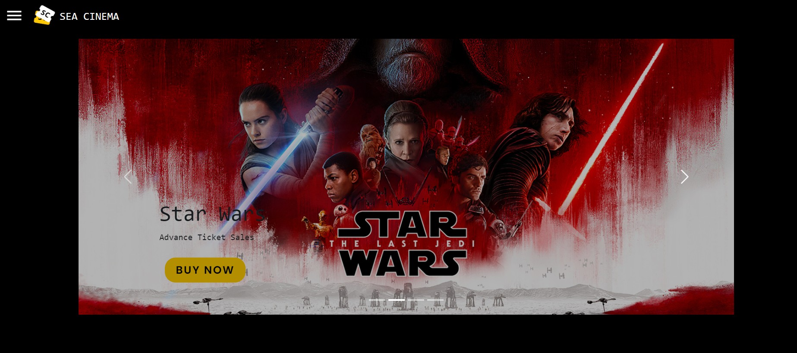
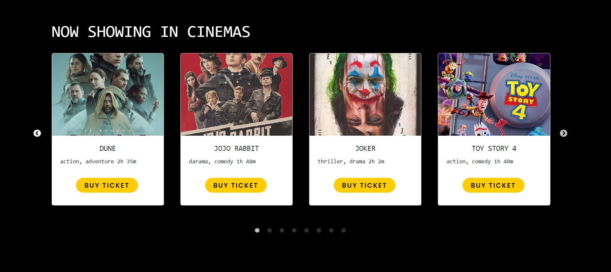

# Sea Cinema

## About the Program
Sea Cinema is a web application that allows users to browse movies, book tickets, and manage their cinema experience. Users can view movie details, including synopsis, cast, age rating, and ticket price. They can also select seats, provide personal information, and make payments for their movie tickets.

## Technologies Used
1. React: Front-end JavaScript library for building user interfaces.

2. React Router: Library for routing in React applications.

3. React Bootstrap: UI library for styling and components.

4. Material-UI: UI library for icons and components.

## Build Program
To build the Maze Solver program, follow these steps:

1. Clone this repository
2. Open Visual Studio 2022 and navigate to the cloned repository.
3. Open the solution file `TESTING.sln` in Visual Studio.
4. From the top toolbar, click on `Build` and then select `Build Solution`.
5. After the build process is complete, your executable file should be located in the `./bin` directory. Look for `TESTING.exe` in that directory.

## Installation
To run the Maze Solver program, follow these steps:

1. Clone this repository
'''bash
git clone https://github.com/your-username/sea-cinema.git
'''
2. Navigate to the project directory:
'''bash
cd sea-cinema
'''
3. Install the dependencies:
'''bash
npm install
'''
4. Start the development server:
'''bash
npm start
'''
5. Open [http://localhost:3000](http://localhost:3000) with your browser to see the result.
                                  
## Documentation

