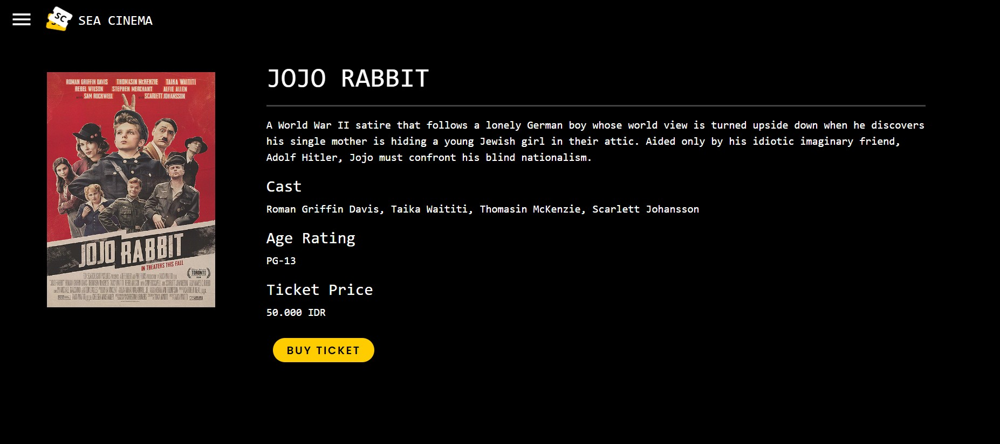
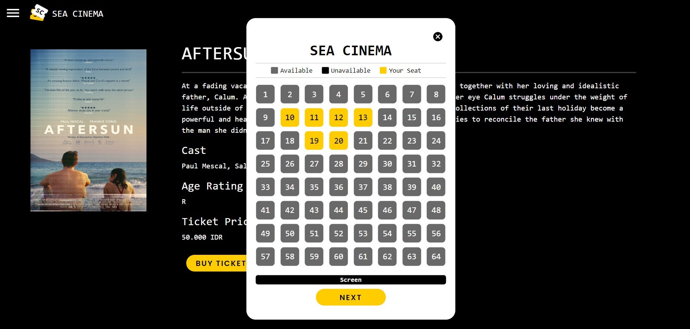
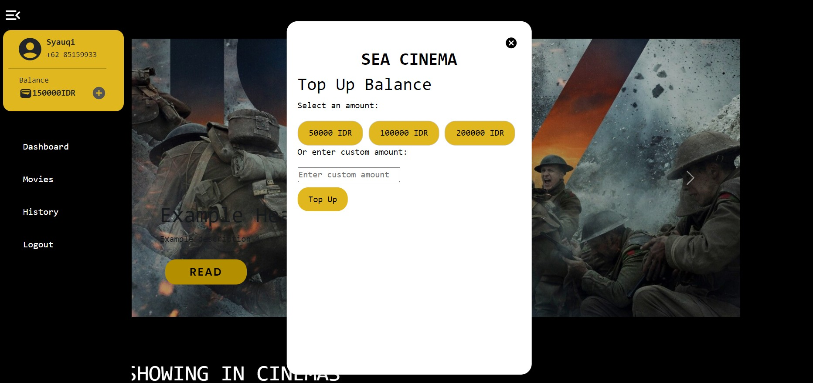

# Sea Cinema

## About the Program
Sea Cinema is a web application that allows users to browse movies, book tickets, and manage their cinema experience. Users can view movie details, including synopsis, cast, age rating, and ticket price. They can also select seats, provide personal information, and make payments for their movie tickets.

## Technologies Used
1. React: Front-end JavaScript library for building user interfaces.

2. React Router: Library for routing in React applications.

3. React Bootstrap: UI library for styling and components.

4. Material-UI: UI library for icons and components.

## Installation
To run the Maze Solver program, follow these steps:

1. Clone this repository
'''
git clone https://github.com/your-username/sea-cinema.git
'''
2. Navigate to the project directory:
'''
cd seacinema
'''
3. Install the dependencies:
'''
npm install
'''
4. Start the development server:
'''
npm start
'''
5. Open [http://localhost:3000](http://localhost:3000) with your browser to see the result.
                                  
## Screenshots

